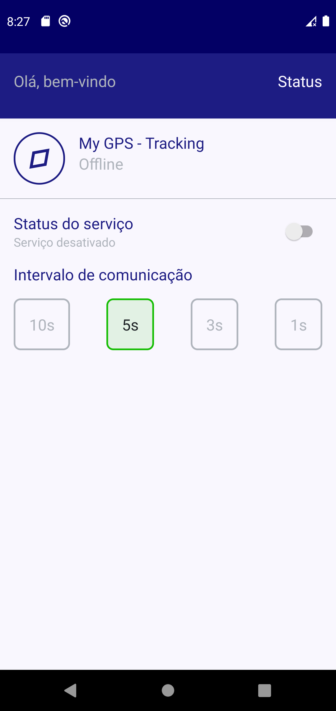
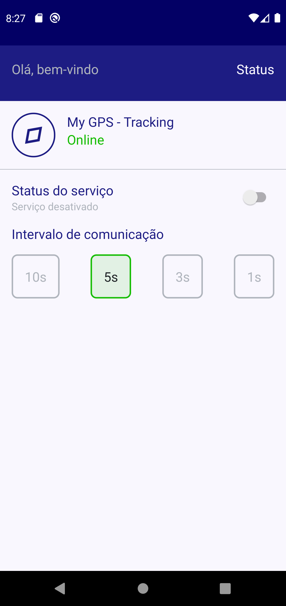
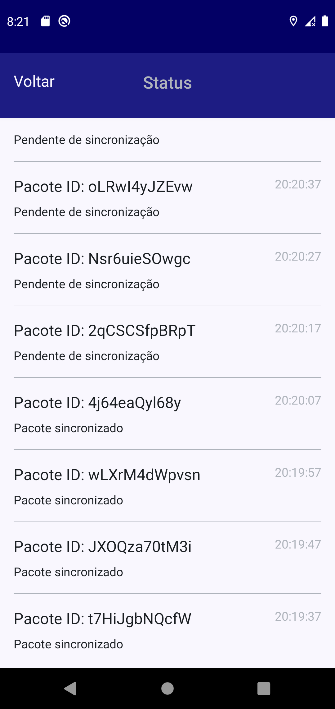

<!-- PROJECT SHIELDS -->
<!--
*** I'm using markdown "reference style" links for readability.
*** Reference links are enclosed in brackets [ ] instead of parentheses ( ).
*** See the bottom of this document for the declaration of the reference variables
*** for contributors-url, forks-url, etc. This is an optional, concise syntax you may use.
*** https://www.markdownguide.org/basic-syntax/#reference-style-links
-->

[![Forks][forks-shield]][forks-url]
[![Stargazers][stars-shield]][stars-url]
[![Issues][issues-shield]][issues-url]

<!-- [![MIT License][license-shield]][license-url] -->

[![LinkedIn][linkedin-shield]][linkedin-url]

<!-- PROJECT LOGO -->
<br />
<p align="center">
  <a href="https://github.com/hmarques98/RNOffGeoLoc/blob/main/docs/home_offline.png">
    
  </a>

  <h3 align="center">React Native App GeoLocation Offline - React Native</h3>

  <p align="center">
    Consuming local api with key's packages from local api and using in React Native App
    <br />
    <br />
    <a href="https://github.com/hmarques98/RNOffGeoLoc/issues">Report Bug</a>
    ·
    <a href="https://github.com/hmarques98/RNOffGeoLoc/issues">Request Feature</a>
   
  </p>
</p>

<!-- TABLE OF CONTENTS -->
<details open="open">
  <summary>Table of Contents</summary>
  <ol>
    <li>
      <a href="#about-the-project">About The Project</a>
      <ul>
        <li><a href="#built-with">Built With</a></li>
      </ul>
    </li>
    <li>
      <a href="#getting-started">Getting Started</a>
      <ul>
        <li><a href="#installation">Installation</a></li>
      </ul>
    </li>
    <li><a href="#usage">Usage</a></li>
    <li><a href="#what-to-improve">What to improve</a></li>
    <li><a href="#roadmap">Roadmap</a></li>
    <li><a href="#contributing">Contributing</a></li>
    <li><a href="#license">License</a></li>
    <li><a href="#contact">Contact</a></li>
  </ol>
</details>

<!-- ABOUT THE PROJECT -->

## About The Project

 <a href="https://github.com/hmarques98/RNOffGeoLoc/tree/main/docs">
    
    
  </a>

It was built a application using React Native as framework and consuming a api from React Native App GeoLocation Offline Api. Also used libraries how Storybook, React Query, Plops Js, Lottie among others.

### Built With

- [Typescript](https://www.typescriptlang.org/)
- [React](https://reactjs.org/)
- [React Native](https://reactnative.dev/)
- [Storybook](https://reactnative.dev/)
- [Styled System](https://styled-system.com/)
- [Styled Components](https://styled-components.com/)
- [PlopJS](https://plopjs.com/)
- [React Query](https://react-query.tanstack.com/)
- [React Native Flipper](https://fbflipper.com/docs/features/react-native/)
- [Axios](https://github.com/axios/axios)
- [React Native BootSplash](https://github.com/zoontek/react-native-bootsplash)
- [React Native Vector Icons](https://github.com/oblador/react-native-vector-icons)

<!-- GETTING STARTED -->

## Getting Started

You need to have installed NodeJs and configured your OS to run on emulator to Android or simulator to iOS

### Installation

1. Clone the repo
   ```sh
   git clone https://github.com/hmarques98/RNOffGeoLoc
   ```
2. Install NPM packages
   ```sh
   npm install or yarn add
   ```
3. To iOS install pods with command`
   ```sh
   npx pod install
   ```
4. To run on device or emulator

   ```sh
   yarn android #to android
   ```

   ```sh
   yarn ios #to iOS
   ```

<!-- USAGE EXAMPLES -->

## Usage

In project directory src is all of file to screens and components

The folder plop-templates has all templates to generate templates to create a Component.

To create with script run:

Will to prompt what is name component

```sh
yarn generate component
```

The folder storybook has all configuration working storybook library

To see working go to index.js in root directory and change to true the variable:
Ex:

```js
const showStorybook = true;
```

Now go to your application and you will see the library working and components Button, Typography and Box created.

<!-- CONTRIBUTING -->

## Contributing

Contributions are what make the open source community such an amazing place to be learn, inspire, and create. Any contributions you make are **greatly appreciated**.

1. Fork the Project
2. Create your Feature Branch (`git checkout -b feature/AmazingFeature`)
3. Commit your Changes (`git commit -m 'Add some AmazingFeature'`)
4. Push to the Branch (`git push origin feature/AmazingFeature`)
5. Open a Pull Request

<!-- LICENSE -->

## License

Distributed under the MIT License. See `LICENSE` for more information.

<!-- CONTACT -->

## Contact

Henrique Marques - [@hmarques98\_](https://twitter.com/@hmarques98) - marquesprogrammer@hotmail.com.com

Project Link: [https://github.com/hmarques98/RNOffGeoLoc](https://github.com/hmarques98/RNOffGeoLoc)

<!-- ACKNOWLEDGEMENTS -->

<!-- MARKDOWN LINKS & IMAGES -->
<!-- https://www.markdownguide.org/basic-syntax/#reference-style-links -->

[contributors-url]: https://github.com/hmarques98/RNOffGeoLoc/graphs/contributors
[forks-shield]: https://img.shields.io/github/forks/hmarques98/RNOffGeoLoc.svg?style=for-the-badge
[forks-url]: https://github.com/hmarques98/RNOffGeoLoc/network/members
[stars-shield]: https://img.shields.io/github/stars/hmarques98/RNOffGeoLoc.svg?style=for-the-badge
[stars-url]: https://github.com/hmarques98/RNOffGeoLoc/stargazers
[issues-shield]: https://img.shields.io/github/issues/hmarques98/RNOffGeoLoc.svg?style=for-the-badge
[issues-url]: https://github.com/hmarques98/RNOffGeoLoc/issues
[license-shield]: https://img.shields.io/github/license/hmarques98/RNOffGeoLoc.svg?style=for-the-badge
[license-url]: https://github.com/hmarques98/RNOffGeoLoc/blob/master/LICENSE.txt
[linkedin-shield]: https://img.shields.io/badge/-LinkedIn-black.svg?style=for-the-badge&logo=linkedin&colorB=555
[linkedin-url]: https://linkedin.com/in/hmarques98
[product-screenshot]: images/screenshot.png
